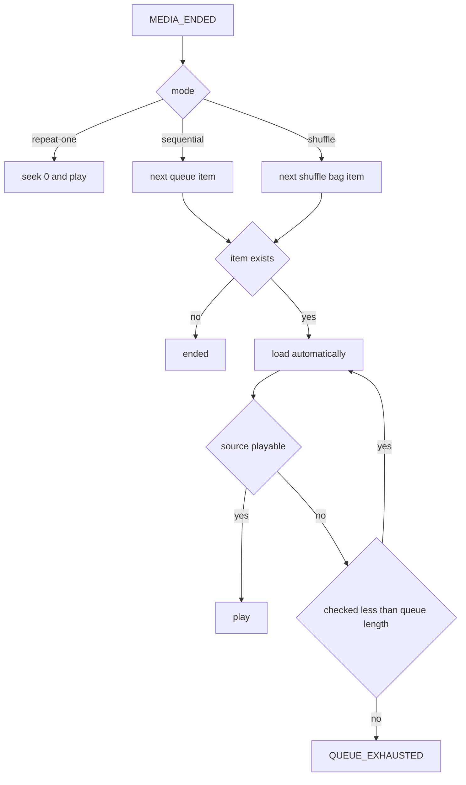

# ECHOFORM 播放器状态机

> 状态：Implementation Baseline
> 冻结日期：2026-07-29
> 范围：单标签页、持久 Audio、队列、音源、歌词和错误恢复
> 关联文档：`TECHNICAL_ARCHITECTURE.md`、`NETEASE_API_CONTRACT.md`

## 1. 结论

播放器不能用一个 `isPlaying` Boolean 表示。ECHOFORM 使用三个正交状态区：播放生命周期、
网络状态和 Seek 状态；再用 `desiredPlayback` 保存用户意图。这样才能区分“用户暂停”、
“仍想播放但正在缓冲”和“加载失败”。

状态机由根布局中的唯一 `AudioController` 驱动。React 页面发送命令、订阅快照，不直接
操作 `HTMLAudioElement`。路由切换、预览退出和完整播放页切换都不能重建 Audio。

## 2. 核心类型

```ts
export type PlaybackStatus =
  | "idle"
  | "loading"
  | "ready"
  | "playing"
  | "paused"
  | "ended"
  | "error";

export type NetworkStatus = "idle" | "buffering" | "stalled";

export type SeekStatus = "idle" | "seeking";

export type DesiredPlayback = "paused" | "playing";

export type PlaybackMode = "sequential" | "shuffle" | "repeat-one";

export type PlaybackSource = {
  url: string;
  expiresAt: number;
  quality: AudioQuality;
  codec: string | null;
  bitrate: number | null;
  sampleRate: number | null;
  sizeBytes: number | null;
  corsMode: "anonymous" | "unavailable";
};
```

完整快照：

```ts
export type PlayerSnapshot = {
  playbackStatus: PlaybackStatus;
  networkStatus: NetworkStatus;
  seekStatus: SeekStatus;
  desiredPlayback: DesiredPlayback;

  currentTrack: Track | null;
  source: PlaybackSource | null;
  queue: QueueItem[];
  currentIndex: number;
  mode: PlaybackMode;

  currentTimeMs: number;
  durationMs: number | null;
  bufferedUntilMs: number;
  volume: number;
  muted: boolean;

  activeLyricLine: number | null;
  error: PlayerError | null;
  sleepTimer: SleepTimer | null;

  loadRevision: number;
  sourceRefreshCount: number;
};
```

`currentTimeMs` 和 `bufferedUntilMs` 是 Audio 的投影，不是第二个时间源。
`volume` 是用户选择并持久化的基础音量。Sleep Timer 渐弱使用 Controller 内部的临时
`sleepFadeGain`，不得改写 `volume` 或其持久化值。

## 3. 状态语义

### 3.1 PlaybackStatus

| 状态 | 含义 | Audio 要求 |
| --- | --- | --- |
| `idle` | 没有当前歌曲 | 无 `src`，时间为 0 |
| `loading` | 正在取详情/音源或执行 `audio.load()` | 可无 source，不可报告 playing |
| `ready` | 已有可用 source，尚未开始过 | paused，metadata 可用 |
| `playing` | `play` 事件已发生且未暂停 | `audio.paused === false` |
| `paused` | 用户或系统主动暂停 | `audio.paused === true` |
| `ended` | 当前队列按模式自然结束 | 保留当前歌曲和最终时间 |
| `error` | 当前选择无法继续 | paused，带结构化错误 |

`audio.play()` Promise resolve 之前不能进入 `playing`。`PLAY` 命令只把
`desiredPlayback` 改为 `playing` 并发起请求。

### 3.2 NetworkStatus

- `idle`：没有等待网络，或当前不播放。
- `buffering`：收到 `waiting`，仍有恢复可能。
- `stalled`：收到 `stalled`，或希望播放时 3 秒没有时间推进且
  `readyState < HTMLMediaElement.HAVE_FUTURE_DATA`。

`buffering` 和 `stalled` 不覆盖 `playbackStatus`。例如播放意图仍是 playing 时，快照可为
`playing + buffering`，UI 显示缓冲但播放按钮仍表达“点击会暂停”。

### 3.3 SeekStatus

- Pointer/键盘开始拖动时进入 `seeking`。
- 拖动期间 UI 展示预览时间，Audio 是否实时 Seek 由输入设备策略决定。
- 提交目标后设置 `audio.currentTime`；收到 `seeked` 才回到 `idle`。
- Seek 期间用户按暂停，暂停命令立即生效，Seek 完成后不得自动恢复。

## 4. 不变量

1. 应用生命周期内最多存在一个 Audio 元素和一个 AudioController。
2. `currentTrack === null` 时必须是 `idle`，source、歌词和 currentIndex 同步清空。
3. `playing` 必须同时有 currentTrack、source，且 `desiredPlayback === "playing"`。
4. `error` 必须有 `PlayerError`，且 Audio 不得继续发声。
5. `source.url` 不进入持久存储、日志、URL、analytics 或 React Dev 数据导出。
6. 只有当前 `loadRevision` 的异步结果可以修改状态。
7. 每个 track load 最多自动刷新一次音源；失败后不得无限循环。
8. 自动跳过一轮最多检查队列长度个项目。
9. 页面路由卸载不能暂停、清空或替换 Audio。
10. 歌词活动行只能由 Audio 时间推导，不能反向驱动播放进度。

开发环境违反不变量时抛出明确错误；生产环境进入安全的 paused/error 并记录脱敏诊断。

## 5. 命令与事件

### 5.1 页面可发送的命令

```ts
export type PlayerCommand =
  | { type: "LOAD_TRACK"; track: Track; queue?: QueueItem[]; autoplay: boolean }
  | { type: "PLAY" }
  | { type: "PAUSE"; reason: PauseReason }
  | { type: "TOGGLE_PLAYBACK" }
  | { type: "SEEK_START" }
  | { type: "SEEK_PREVIEW"; timeMs: number }
  | { type: "SEEK_COMMIT"; timeMs: number }
  | { type: "NEXT"; origin: "user" | "automatic" }
  | { type: "PREVIOUS" }
  | { type: "SET_QUEUE"; queue: QueueItem[]; startTrackId?: string }
  | { type: "ENQUEUE"; item: QueueItem }
  | { type: "REMOVE_FROM_QUEUE"; queueItemId: string }
  | { type: "SET_MODE"; mode: PlaybackMode }
  | { type: "SET_VOLUME"; volume: number }
  | { type: "SET_MUTED"; muted: boolean }
  | { type: "SET_SLEEP_TIMER"; timer: SleepTimer | null }
  | { type: "RETRY" }
  | { type: "UNLOAD" };
```

组件不能接触 Audio 方法；快捷键、Media Session、播放条、预览页和完整播放页都发送同一
命令类型。

### 5.2 Audio 与异步事件

```ts
export type PlayerEvent =
  | { type: "SOURCE_RESOLVED"; revision: number; source: PlaybackSource }
  | { type: "SOURCE_REJECTED"; revision: number; error: PlayerError }
  | { type: "MEDIA_LOADEDMETADATA"; revision: number; durationMs: number }
  | { type: "MEDIA_CANPLAY"; revision: number }
  | { type: "MEDIA_PLAY"; revision: number }
  | { type: "MEDIA_PAUSE"; revision: number }
  | { type: "MEDIA_TIME"; revision: number; currentTimeMs: number }
  | { type: "MEDIA_PROGRESS"; revision: number; bufferedUntilMs: number }
  | { type: "MEDIA_WAITING"; revision: number }
  | { type: "MEDIA_STALLED"; revision: number }
  | { type: "MEDIA_SEEKED"; revision: number }
  | { type: "MEDIA_ENDED"; revision: number }
  | { type: "MEDIA_ERROR"; revision: number; mediaCode: number | null }
  | { type: "PLAY_REJECTED"; revision: number; name: string }
  | { type: "SLEEP_TIMER_TICK"; now: number }
  | { type: "SLEEP_TIMER_FIRED" };
```

所有 Media listener 在 Controller 创建时绑定一次，在销毁应用时解除一次。

## 6. 主状态迁移

| 当前 | 输入 | 动作 | 下一个状态 |
| --- | --- | --- | --- |
| 任意 | `LOAD_TRACK` | 增加 revision，取消旧请求，暂停旧 source，取新 source | `loading` |
| `loading` | `SOURCE_RESOLVED` | 设置 `audio.src`、`crossOrigin`，调用 load | `loading` |
| `loading` | `MEDIA_LOADEDMETADATA` | 设置 duration；按 autoplay 决定是否 play | `ready` 或等待 play |
| `ready/paused/ended` | `PLAY` | 设置 desired=playing，必要时刷新 source，调用 play | 状态暂不变 |
| 任意可播 | `MEDIA_PLAY` | 清错误、network=idle | `playing` |
| `playing/ready` | `PAUSE` | desired=paused，调用 pause | `paused`，等待 media pause 校正 |
| 任意 | `MEDIA_PAUSE` | 非 ended 且非 loading 时同步暂停 | `paused` |
| `playing` | `MEDIA_WAITING` | 保持 desired=playing | `playing + buffering` |
| `playing` | `MEDIA_STALLED` | 启动恢复计时 | `playing + stalled` |
| 缓冲/停滞 | `MEDIA_CANPLAY` | network=idle；desired=playing 时继续 play | `playing` 或 `paused` |
| 任意可 Seek | `SEEK_START` | 保存拖动前意图 | `seekStatus=seeking` |
| `seeking` | `SEEK_COMMIT` | clamp 后设置 currentTime | 等待 `MEDIA_SEEKED` |
| `seeking` | `MEDIA_SEEKED` | 按当前 desired 决定 play/pause | `seekStatus=idle` |
| `playing` | `MEDIA_ENDED` | 按 mode 计算后继 | load 后继、repeat 或 `ended` |
| 非 idle | `MEDIA_ERROR` | 尝试一次 source 刷新，否则归一化错误 | `loading` 或 `error` |
| `error` | `RETRY` | 增加 revision，从详情/source 重新开始 | `loading` |
| 任意 | `UNLOAD` | 取消请求，pause，移除 src，清上下文 | `idle` |

## 7. Load 与快速切歌

### 7.1 Load 算法

1. `loadRevision += 1`，创建本次 `AbortController`。
2. 取消旧详情、音源、歌词和评论请求；旧 Response 即使返回也丢弃。
3. 立即把 currentTrack 指向用户新选择，以支持共享封面转场。
4. `playbackStatus = loading`，`desiredPlayback` 由 `autoplay` 决定。
5. 获取 source；source 失败按“用户选择”或“自动前进”分别处理。
6. 设置 `audio.crossOrigin = "anonymous"` 后再设置 `src`。
7. `audio.load()`，等待 metadata/canplay。
8. desired=playing 时调用 `play()`；否则进入 ready。
9. 歌词异步加载，不阻塞音频开始。

### 7.2 最新意图优先

用户连续点击 A、B、C 时，只允许 C 的 revision 更新 Audio。A/B 的网络请求被取消；无法
取消的 Response 通过 revision 丢弃。旧 Audio 的 `ended`、`error`、`canplay` 事件也必须
带当前 source token 校验。

共享封面动画可以继续到新的目标，但不能等待旧请求或排队播放旧歌曲。

## 8. Play、Pause 与 Autoplay

### 8.1 Play

- source 距离过期不足 60 秒时先刷新。
- 调用 `audio.play()` 后等待 Promise 和 `play` 事件。
- Promise resolve 但事件未到时仍不报告 playing。
- 多次 PLAY 在同一 revision 内幂等，不创建多个 Promise 链。

### 8.2 Pause

- PAUSE 立即设置 `desiredPlayback = paused`，再调用 `audio.pause()`。
- pending source、Seek、缓冲或 `play()` Promise 都不能在之后自动恢复。
- Sleep Timer、Media Session、快捷键和 UI Pause 使用同一命令。

### 8.3 浏览器拒绝 Autoplay

若 `play()` 以 `NotAllowedError` 拒绝：

- 状态进入 `paused`，`desiredPlayback = paused`。
- 设置非致命 `AUTOPLAY_BLOCKED`，显示可操作的播放按钮。
- 不自动重试，不弹持续 Toast，不跳过歌曲。
- 下一次真实用户手势 PLAY 清除此提示并重试。

其他 play rejection 按网络、source 或未知媒体错误归一化。

## 9. Seek

- 目标值 clamp 到 `[0, durationMs]`；未知 duration 时拒绝 Seek。
- 键盘方向键每次 5 秒，`Shift` + 方向键每次 15 秒。
- Pointer 拖动时最多每动画帧更新视觉预览，提交时只写一次 Audio currentTime。
- 点击轨道可直接 commit，不要求先进入连续拖动。
- Seek 触发 waiting 时 network=buffering，但 seekStatus 保持 seeking 直到 `seeked`。
- Seek 到结尾后由真实 `ended` 事件决定队列行为，不手工伪造 ended。
- Seek 不改变用户的 desiredPlayback；只有用户 Pause 能改变。

## 10. Buffering 与 Stalled

### 10.1 Buffering

收到 waiting：

- 设置 network=buffering。
- 保留 playing 生命周期和 desired=playing。
- 100ms 内更新局部缓冲视觉，但不移动布局。
- canplay/playing/time 推进后恢复 network=idle。

### 10.2 Stalled

满足任一条件进入 stalled：

- 浏览器发送 `stalled`。
- desired=playing、非 seeking、readyState 不足，且 3 秒没有 currentTime 推进。

恢复策略：

1. 继续等待最多 7 秒；期间 canplay/time 推进立即恢复。
2. 若 source 已到刷新窗口，刷新一次并回到原时间。
3. 若 source 未过期，执行一次受控 reload，并恢复原时间。
4. 同一 track 仍失败则进入 `NETWORK_ERROR`，保留 Retry 和 Next。

不在 stalled 时自动连跳歌曲；只有自动前进加载后继失败才执行队列跳过算法。

## 11. 音源过期与恢复

### 11.1 过期判断

```ts
const shouldRefresh = Date.now() >= source.expiresAt - 60_000;
```

`expi` 是上游相对秒数，Provider 在收到 Response 时转换为绝对时间。系统时间明显异常时
把 source 视为需刷新。

### 11.2 刷新流程

1. 保存 currentTime、desiredPlayback、volume 和 playbackRate。
2. `sourceRefreshCount += 1`；同一 load revision 最多一次自动刷新。
3. 请求相同 track 和期望 quality 的新 source。
4. 设置新 src，等待 metadata，把 currentTime 恢复到合法范围。
5. desired=playing 时继续 play；否则保持 paused。

若刷新返回不同实际音质，更新 UI 的实际 quality。若返回无 URL，进入对应不可播放错误。

### 11.3 Media Error

| MediaError code | 首次处理 | 失败后 |
| --- | --- | --- |
| 1 aborted | 判断是否由新 load 引起；是则忽略 | 非预期时 `MEDIA_ABORTED` |
| 2 network | source 近过期则刷新，否则受控 reload | `NETWORK_ERROR` |
| 3 decode | 不重复下载同 codec；报告格式错误 | `DECODE_ERROR` |
| 4 src not supported | 刷新一次并检查 codec/CORS | `SOURCE_UNSUPPORTED` |
| null/未知 | 刷新一次 | `UNKNOWN_MEDIA_ERROR` |

## 12. 不可播放歌曲

`check_music` 只作提示，`song_url_v1` 的行 code 与 URL 才是最终判据。错误类型：

```ts
type PlayerErrorCode =
  | "AUTOPLAY_BLOCKED"
  | "TRACK_UNAVAILABLE"
  | "VIP_REQUIRED"
  | "REGION_RESTRICTED"
  | "SOURCE_EXPIRED"
  | "SOURCE_UNSUPPORTED"
  | "DECODE_ERROR"
  | "NETWORK_ERROR"
  | "UPSTREAM_ERROR"
  | "QUEUE_EXHAUSTED"
  | "UNKNOWN_MEDIA_ERROR";
```

- 用户主动点击的歌曲不可播：停在 error，保留歌曲封面、原因、Retry 和 Next，不偷偷跳走。
- 当前曲自然结束后的自动前进：不可播项自动跳过，并给简短可访问播报。
- 自动跳过最多检查队列长度个 item；一轮无可播项后 `QUEUE_EXHAUSTED`。
- VIP、地区和版权无法可靠区分时统一显示“当前歌曲不可播放”，不编造具体原因。

## 13. 队列与播放模式

### 13.1 QueueItem

```ts
export type QueueItem = {
  queueItemId: string;
  track: Track;
  sourceContext: "daily" | "search" | "album" | "playlist" | "manual";
};
```

同一 track 可在队列出现多次，因此队列操作使用 `queueItemId`，播放请求使用 `track.id`。

### 13.2 Sequential

- NEXT 到下一索引。
- 当前曲 ended 且位于队尾时进入 ended，不循环。
- 队尾手动 NEXT 保持 ended，并通过 disabled 控件表达边界。
- 队首 PREVIOUS：若当前时间大于 3 秒则回到 0；否则仍回到 0。
- 非队首 PREVIOUS：当前时间大于 3 秒先回到 0，否则加载上一首。

### 13.3 Shuffle

- 为当前队列建立 shuffle bag，当前项不重复进入 bag。
- 每项在一轮中最多播放一次；bag 用尽后进入 ended，不隐式开始新一轮。
- 用户回退使用播放历史栈，不重新随机。
- 新增 item 放入剩余 bag；移除 item 同时从 bag 和未来历史中清理。
- 切换回 sequential 时以当前 item 的实际队列索引继续。

随机算法用 Fisher-Yates；测试注入 seed，产品运行使用 Web Crypto 随机数。

### 13.4 Repeat One

- 自然 ended 时同曲回到 0 并继续。
- 手动 NEXT/PREVIOUS 仍切换队列，不被 repeat-one 拦截。
- 当前曲不可播或刷新失败时不无限重复，进入 error。

### 13.5 修改队列

- 删除非当前 item 不影响播放。
- 删除当前 item 时立即加载逻辑后继；无后继则进入 ended。
- 替换队列时若保留当前 queueItemId，则播放不重启，只更新索引。
- 替换队列且不含当前项时，按 `startTrackId` 或首项加载；空队列执行 UNLOAD。

## 14. Ended 与自动前进



`MEDIA_ENDED` 必须来自当前 revision。Seek 或换源造成的旧 ended 事件一律忽略。

## 15. 歌词同步

### 15.1 时间源

- 唯一真值是 `audio.currentTime * 1000`。
- playing 且页面可见时用 `requestAnimationFrame` 读取以保证视觉顺滑。
- 页面隐藏或 Reduced Motion 时用 `timeupdate` 事件即可。
- 不对时间做 easing；动画只作用于文字透明度/位置，不改变命中时间。
- 可见播放态允许每帧采样，但高频时间线必须与队列、命令、错误和路由的语义快照隔离；它只能唤醒 ProgressRail 与 LyricsViewport 等时间消费者。
- LyricsViewport 以实际命中行/词变化为最小 React 更新范围；ProgressRail 可通过窄订阅或受控 DOM 值持续更新。两者不得为减少重渲染而降低真实时间精度。

### 15.2 活动行

- 歌词行按 `startMs` 排序并通过二分查找定位最后一个 `startMs <= currentTimeMs` 的行。
- Seek 后立即重新计算，不逐行补动画。
- 有 words 时在活动行内按同样规则计算单词；无 yrc 时只高亮整行。
- plain/instrumental/unavailable 都是正常模型，不进入 player error。
- 用户手动滚歌词后进入 5 秒 browse lock；播放继续，但不自动把视图拉回。
- 用户点击“回到当前”或 lock 超时后恢复跟随。

## 16. 路由、预览与页面生命周期

- PlayerProvider 位于根布局，所有页面共享同一快照。
- 从画廊进入预览，只改变页面展示和选择，不自动重建已在播放的同曲。
- 预览页滚轮退出只关闭预览；若歌曲正在播放，音乐继续。
- `EXPLORE` 进入本地完整播放路由，播放无缝继续。
- 完整播放页内部滚动歌词、评论和队列不能触发预览退出逻辑。
- 浏览器 Back 恢复画廊位置，但不回滚播放器到历史歌曲。
- 完整刷新会丢失内存队列和播放位置；当前版本不伪装跨刷新续播。

## 17. Sleep Timer

```ts
type SleepTimer =
  | { kind: "after-duration"; firesAt: number }
  | { kind: "end-of-track" };
```

- after-duration 使用绝对 `firesAt`，页面后台也有效。
- end-of-track 在当前曲自然结束时先暂停，不执行队列自动前进。
- Timer 触发发送 PAUSE，原因 `sleep-timer`，不清队列和当前时间。
- 用户手动下一首不触发 end-of-track timer。
- Timer 状态只存在当前标签页；刷新后清除。
- 到期前最后 3 秒使用线性临时增益渐弱：after-duration 按
  `clamp((firesAt - now) / 3000, 0, 1)` 计算；end-of-track 在 duration 有效时按剩余
  播放时间使用同一公式。duration 未知时不伪造倒计时，在真实 ended 时直接暂停。
- 实际 Audio 输出为 `muted ? 0 : volume * sleepFadeGain`。渐弱不得修改系统音量、用户
  `volume`、静音偏好或 localStorage。
- Timer 触发、取消或被新 Timer 替换后，先暂停（若需要），再把 `sleepFadeGain` 恢复为
  `1`，保证用户下次播放仍使用保存音量。
- `SLEEP_TIMER_TICK` 只驱动临时增益；后台计时以绝对时间和最终触发定时器为准，不能依赖
  `requestAnimationFrame` 准点暂停。

## 18. 页面后台与系统控制

- 标签页隐藏后音频继续播放，除非用户设置或系统策略暂停。
- 隐藏时停止歌词 rAF 和非必要 WebGL；依赖 Audio 事件更新进度。
- 回到前台立即读取 currentTime、duration、paused 和 buffered 校正快照。
- WebGL 画廊在 `hidden` 状态停止调度，在恢复可见时以当前画廊/预览状态完成一次校正绘制；音频、队列和当前歌曲不因图形休眠发生改变。
- Media Session 的 play/pause/next/previous/seek handler 发送同一 PlayerCommand。
- 系统耳机拔出、来电或浏览器策略造成 pause 时，接受 `MEDIA_PAUSE` 并进入 paused；不自动
  抢回播放。
- 多标签页互斥不在 P0；若后续实现，需要新的跨标签协调规格。

## 19. Sleep、错误与用户反馈优先级

同一事件循环出现冲突时按以下顺序处理：

1. `UNLOAD` 或最新 `LOAD_TRACK`，使旧 revision 全部失效。
2. 用户 `PAUSE`，覆盖 pending play、Seek 恢复和 canplay 自动恢复。
3. Sleep Timer pause。
4. 当前 revision 的 fatal source/media error。
5. 用户 PLAY/NEXT/PREVIOUS。
6. 当前 revision 的 Media 状态同步。
7. 歌词、进度、buffered 等展示更新。

最新 `LOAD_TRACK` 之间以最后命令为准。命令 reducer 必须同步更新意图，再执行 Audio
副作用，防止 Promise 回调覆盖新意图。

## 20. React 订阅与性能

- Controller 使用外部 store 或等价 selector 订阅，不能每个 `timeupdate` 重渲染 AppShell。
- 播放按钮订阅 status/intent，ProgressRail 订阅时间，LyricsViewport 订阅活动行。
- 高频 currentTime 更新最多一帧一次；后台按浏览器事件频率。
- 队列和 Track 对象保持稳定引用，只有实际改变时发布新快照。
- WebGL 读取分析数据时必须检查 `corsMode`；unavailable 时使用非音频数据的静态/低动效
  降级，不能破坏播放。
- 高低频发布须分层：时间线更新不能使 `PlayerPublicSnapshot` 每帧成为新的通用订阅值。语义订阅只在 status、intent、currentTrack、queue、mode、error、Seek 或 source 生命周期变化时通知。
- selector 返回对象时必须保持稳定引用或采用明确比较；禁止在页面级组件订阅整个播放器快照来间接读取少数时间字段。
- 进度、缓冲和 ARIA 数值的高频更新只驻留在 ProgressRail；歌词只订阅实际活动行/词。任何按帧 UI 更新都不得包含 AppShell、导航、队列、封面列表或不相关页面。

## 21. 可访问性

- 播放按钮标签包含动作与歌曲名，例如“暂停《歌曲名》”。
- buffering、stalled、不可播放和自动跳过通过节流 live region 播报。
- ProgressRail 暴露当前值、总时长和格式化文本，支持方向键。
- error 不只依赖颜色，必须有原因、Retry 和 Next 等可执行动作。
- Reduced Motion 不改变状态机，只替换大位移转场和自动滚动表现。
- Autoplay 被拒绝后焦点不被 Toast 抢走，播放按钮保持可达。

## 22. 测试矩阵

### 22.1 单元测试

- idle -> load -> ready -> play -> pause -> play -> ended。
- 快速 A/B/C load 只有 C 生效。
- pending play 后立即 pause 不会被 Promise 恢复。
- Seek 中 pause、Seek 到边界、未知 duration。
- waiting/canplay、stalled/reload、stalled/refresh、恢复失败。
- source 到期前刷新、刷新一次失败、不发生无限请求。
- sequential 队首/队尾、shuffle bag、repeat-one 手动 next。
- 自动跳过 1 项、多项和全部不可播。
- yrc 有/无、翻译合并、Seek 后歌词定位。
- Sleep duration、end-of-track、最后 3 秒渐弱、取消恢复音量、刷新清除和后台触发。
- 旧 revision 的 ended/error/canplay 被忽略。
- 可替换帧调度验证画廊 entering/interacting/previewing/settling 连续渲染，而 idle/hidden 无后续 rAF；唤醒和销毁不产生重复调度链。
- Pointer 不变时 raycast 计数保持不变；Pointer、布局或相机变更后只在下一帧完成必要命中。
- 高密度 `MEDIA_TIME`/时间线输入下，ProgressRail 和歌词命中保持准确，但 AppShell、队列与非时间选择器的渲染/通知计数不按帧增长。

### 22.2 组件与 E2E

- 画廊选歌后共享封面进入预览，播放状态保持一致。
- 预览滚轮退出不暂停，首次滚轮不移动画廊。
- EXPLORE 到本地完整播放页不中断 Audio。
- 搜索、用户主页、设置间导航时 Persistent Player 不重建。
- 浏览器拒绝 autoplay 后能以一次点击开始。
- 版权/VIP/地区未知时不显示错误的具体原因。
- 390/768/1440 三宽度控制不重叠，歌词滚动不触发页面退出。
- Reduced Motion 下状态、队列和键盘路径完整。

## 23. 验收条件

- `PLAYER-AC-01`：全应用只有一个 Audio 实例。
- `PLAYER-AC-02`：路由切换、预览退出和 EXPLORE 不重建或中断当前 Audio。
- `PLAYER-AC-03`：playing 只由真实 play 事件确认。
- `PLAYER-AC-04`：Pause 覆盖所有 pending 自动恢复。
- `PLAYER-AC-05`：快速切歌只允许最新 revision 生效。
- `PLAYER-AC-06`：buffering/stalled 与 pause 可被 UI 和状态明确区分。
- `PLAYER-AC-07`：音源到期前刷新，自动刷新最多一次。
- `PLAYER-AC-08`：空 URL、行 code 404 和不可用预检不会进入 playing。
- `PLAYER-AC-09`：自动跳过最多一轮，全部不可播时给出 QUEUE_EXHAUSTED。
- `PLAYER-AC-10`：顺序、随机、单曲循环的队首队尾行为符合本文件。
- `PLAYER-AC-11`：Autoplay 拒绝后不循环重试，用户可一次点击恢复。
- `PLAYER-AC-12`：Seek 不改变用户播放意图，Pause 在 Seek 后仍有效。
- `PLAYER-AC-13`：歌词以 currentTime 为唯一真值，缺少逐字歌词可降级。
- `PLAYER-AC-14`：Sleep Timer 在后台可触发且不清空队列；最后 3 秒渐弱不修改用户保存音量，刷新后清除。
- `PLAYER-AC-15`：旧 source 事件和异步 Response 不能污染当前歌曲。
- `PLAYER-AC-16`：错误提供可执行恢复动作且不只依赖 Toast。
- `PLAYER-AC-17`：音源 URL 不进入持久存储或日志。
- `PLAYER-AC-18`：状态机单元测试、关键 E2E 和 `npm run check` 全部通过。
- `PLAYER-AC-19`：可见播放态的歌词和进度以真实 Audio 时间保持准确；隐藏或 Reduced Motion 时回退浏览器事件频率且回前台立即校正。
- `PLAYER-AC-20`：高频时间线不导致 AppShell、导航、队列和非时间播放器组件按帧重渲染。
- `PLAYER-AC-21`：性能调度不改变 `loadRevision`、暂停优先级、Seek、音源恢复、队列边界或单一 Audio 实例。
## T017B Change Record: Relay Source Boundary

For Real Mode, a resolved `PlaybackSource.url` given to the Audio host is a
same-origin `/api/tracks/:id/audio` path. The provider URL is server-only and
does not enter the controller's public snapshot, persistence, logs, or UI.

This changes only source transport. `LOAD_TRACK`, revision guards, one automatic
source refresh, media events, finite queue traversal, seek behavior, and the
single Audio-element invariant are unchanged. A relay HTTP/media failure is
treated as the existing source/media error and follows the current bounded
recovery policy.
