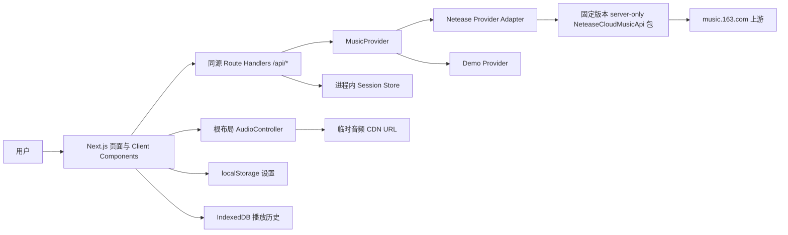
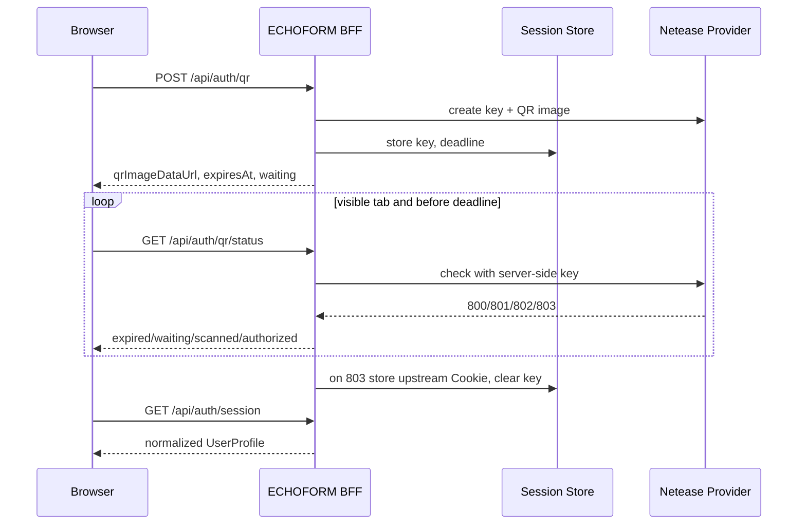

# ECHOFORM 技术架构

> 状态：Implementation Baseline
> 冻结日期：2026-07-29
> 适用范围：本地开发、单实例毕设演示
> 关联文档：`ECHOFORM_PRD_DRAFT.md`、`ECHOFORM_VISUAL_DESIGN.md`、`NETEASE_API_CONTRACT.md`、`PLAYER_STATE_MACHINE.md`

## 1. 结论

ECHOFORM 第一交付版本采用 Next.js 单仓应用：App Router 负责页面，Route
Handlers 组成同源 BFF，浏览器只访问 ECHOFORM 的 `/api/*`，BFF 通过 server-only
Provider 调用固定版本的网易云 API 包。音频元素与播放器控制器挂在根布局下，路由切换
不能重建。

本地答辩版使用进程内 Session Store。页面刷新可保持登录，开发服务器重启后要求重新
扫码。这是刻意限制，不是假装具备生产级账号系统。公开部署需要持久 Session Store、
部署拓扑和密钥管理，属于后续需单独批准的架构变更。

## 2. 架构目标与非目标

### 2.1 目标

- 隔离不稳定且可能变化的上游字段，页面只消费 ECHOFORM 内部模型。
- 上游 Cookie、QR key 和账号凭证不进入浏览器存储、日志、源码或 Git。
- 保证播放不随路由切换中断，并能处理 URL 过期、版权、VIP、地区和网络错误。
- Real Provider 与 Demo Provider 可替换，但两种模式必须在 UI 和应用状态中可辨认。
- 在不引入数据库的前提下，完成本地单实例、单用户的毕设演示。
- 为以后增加自动测试、持久 Session Store 和其他音乐源保留边界。

### 2.2 非目标

- 本阶段不提供多实例部署、跨设备同步或生产级高可用。
- 不绕过网易云版权、VIP、地区或风控限制。
- 不代理、缓存或永久保存完整音频文件。
- 不把 NeteaseCloudMusicApi 的原始 Response 直接暴露给 React 组件。
- 不在本阶段引入数据库、Redis、消息队列或微服务。

## 3. 系统上下文



依赖方向只能从 UI 到 feature service，再到内部契约；上游适配器不能反向依赖页面或
播放器。`src/lib/session/` 只能被 Server Components、Route Handlers 和 server-only
模块导入。

## 4. 运行时边界

### 4.1 浏览器层

负责：

- 页面、可访问性交互和动效。
- 根布局中的 `PlayerProvider`、`AudioController` 与队列状态。
- 调用同源 `/api/*`，消费归一化模型和错误码。
- 使用 `localStorage` 保存非敏感设置。
- 使用 `IndexedDB` 保存本地播放历史。
- 直接播放 BFF 返回的短期音源 URL，但不持久化 URL。

禁止：

- 直连 NeteaseCloudMusicApi。
- 读取或保存上游 Cookie、QR key、`MUSIC_U` 或原始登录 Response。
- 把音源 URL写入 localStorage、IndexedDB、埋点或错误日志。
- 在页面组件内自行创建多个 `HTMLAudioElement`。

### 4.2 同源 BFF

Next.js Route Handlers 负责：

- 参数校验、Session 查找、权限判断和请求超时。
- 调用 `MusicProvider` 并将上游字段转换为内部模型。
- 映射上游业务码、HTTP 状态和网络异常。
- 设置或清除不透明 `sid` Cookie。
- 对私有数据使用 `Cache-Control: no-store`。
- 对音源 URL 设置短生命周期并在到期前刷新。
- 对写操作提供幂等保护和明确结果，不静默重试。

真实 Provider 所在 Route Handler 必须声明 Node.js runtime。固定包依赖文件系统、Node
Crypto 和 CommonJS，不能打入 Edge runtime 或 Client Bundle。

BFF 不负责转发完整音频正文。若未来因 CDN CORS 或部署网络需要音频代理，必须重新
评估带宽、版权和部署成本，并更新本文件后再实现。

### 4.3 MusicProvider

页面和 BFF 不知道网易云参数名。核心接口以内部模型表达：

```ts
export interface MusicProvider {
  startQrLogin(sessionId: string): Promise<QrChallenge>;
  pollQrLogin(sessionId: string): Promise<QrLoginState>;
  getSessionUser(sessionId: string): Promise<UserProfile | null>;
  logout(sessionId: string): Promise<void>;

  getDailyRecommendations(sessionId: string): Promise<Track[]>;
  search(query: SearchQuery, sessionId?: string): Promise<SearchPage>;
  getTrack(trackId: string, sessionId?: string): Promise<Track>;
  getPlaybackSource(
    trackId: string,
    quality: AudioQuality,
    sessionId?: string,
  ): Promise<PlaybackSource>;
  getLyrics(trackId: string, sessionId?: string): Promise<LyricDocument>;
  getComments(trackId: string, page: PageQuery): Promise<CommentPage>;

  setTrackLiked(trackId: string, liked: boolean, sessionId: string): Promise<void>;
  createPlaylist(input: CreatePlaylistInput, sessionId: string): Promise<Playlist>;
  changePlaylistTracks(input: ChangePlaylistTracksInput, sessionId: string): Promise<void>;
  createComment(input: CreateCommentInput, sessionId: string): Promise<Comment>;
}
```

实现包括：

- `NeteaseMusicProvider`：真实上游适配器，server-only 嵌入精确锁定的
  `NeteaseCloudMusicApi@4.32.0`。
- `DemoMusicProvider`：确定性本地夹具，只使用获准的本地演示音频。

Provider 在服务启动时根据显式配置选择。一次请求不能在真实接口失败后自动切换 Demo。

## 5. 目录与所有权

```text
src/app/
  layout.tsx                    根布局与持久 PlayerProvider
  api/                          BFF Route Handlers

src/features/
  auth/                         QR 登录 UI 与客户端会话状态
  player/                       播放器 UI、队列 UI、歌词视图
  discovery/                    日推画廊与歌曲预览
  search/                       搜索输入、结果与分页
  library/                      喜欢、歌单和历史 UI
  profile/                      用户主页 UI

src/lib/music/
  models.ts                     内部 Track/Album/Artist 等模型
  provider.ts                   MusicProvider 接口
  errors.ts                     归一化错误
  netease/                      唯一可接触上游字段的适配器
  demo/                         Demo Provider 实现

src/lib/player/                 AudioController、队列、状态机、歌词同步
src/lib/session/                server-only Session Store
src/lib/theme/                  封面取色与对比度
src/data/demo/                  脱敏夹具和授权音频引用
tests/contract/                 Provider 契约测试
tests/e2e/                      关键路径 E2E
```

创建 feature 目录前，先补对应组件或行为规格。共享 UI 不因“可能复用”提前抽象；至少有
两个真实使用方或属于设计系统基础组件时再移入 `src/components/`。

## 6. BFF HTTP 契约

### 6.1 统一结果

成功：

```ts
type ApiSuccess<T> = {
  ok: true;
  data: T;
  meta?: {
    requestId: string;
    mode: "real" | "demo";
    fetchedAt: string;
  };
};
```

失败：

```ts
type ApiFailure = {
  ok: false;
  error: {
    code: AppErrorCode;
    message: string;
    retryable: boolean;
    requestId: string;
    details?: Record<string, string | number | boolean>;
  };
};
```

`details` 不包含 Cookie、QR key、音源 URL、用户输入的评论正文或原始上游 Response。

### 6.2 路由表

| Method | ECHOFORM 路由 | 登录 | 用途 |
| --- | --- | :---: | --- |
| `GET` | `/api/auth/session` | 否 | 当前登录状态与归一化用户 |
| `POST` | `/api/auth/qr` | 否 | 创建 QR Challenge |
| `GET` | `/api/auth/qr/status` | 否 | 查询当前 Challenge 状态 |
| `POST` | `/api/auth/logout` | 是 | 清理上游与本地 Session |
| `GET` | `/api/recommendations/daily` | 是 | 当前用户每日推荐 |
| `GET` | `/api/search` | 否 | 按歌曲、专辑、歌手搜索 |
| `GET` | `/api/tracks/:id` | 否 | 歌曲详情 |
| `GET` | `/api/tracks/:id/source` | 可选 | 短期播放源 |
| `GET` | `/api/tracks/:id/lyrics` | 否 | 普通、翻译和逐字歌词 |
| `GET` | `/api/tracks/:id/comments` | 否 | 评论分页 |
| `POST` | `/api/tracks/:id/comments` | 是 | 发布或回复评论 |
| `PUT` | `/api/library/likes/:id` | 是 | 喜欢歌曲 |
| `DELETE` | `/api/library/likes/:id` | 是 | 取消喜欢 |
| `GET` | `/api/users/:id` | 否 | 用户主页数据 |
| `GET` | `/api/users/:id/playlists` | 否 | 用户歌单 |
| `POST` | `/api/playlists` | 是 | 创建歌单 |
| `POST` | `/api/playlists/:id/tracks` | 是 | 添加歌曲 |
| `DELETE` | `/api/playlists/:id/tracks/:trackId` | 是 | 移除歌曲 |

写接口在 `NETEASE_API_CONTRACT.md` 标记“登录态实测通过”之前不得进入 Real Provider 的
完成验收，可先在 Demo Provider 内实现 UI 流程。

## 7. Session 与登录

### 7.1 浏览器 Cookie

浏览器只持有 ECHOFORM 生成的随机 `sid`：

```text
HttpOnly; SameSite=Lax; Path=/
Secure 仅在 HTTPS 环境启用
```

`sid` 至少使用 128 bit CSPRNG 随机值。不得使用用户 ID、二维码 key 或上游 Cookie
作为 Session ID。

### 7.2 服务端 Session

```ts
type ServerSession = {
  id: string;
  createdAt: number;
  lastSeenAt: number;
  userId?: string;
  upstreamCookie?: string;
  qr?: {
    key: string;
    expiresAt: number;
    status: "waiting" | "scanned";
  };
};
```

- 本地版本以 `Map<string, ServerSession>` 保存。
- Session 空闲 12 小时清理；QR Challenge 使用独立、较短截止时间。
- 页面刷新继续使用同一 `sid`；服务器重启后 Session 消失并回到访客态。
- 登录成功时只在服务端保存上游 Cookie，并立即清除 QR key。
- 登出先尝试上游登出，再无条件销毁本地 Session。
- 轮询 API 不返回 QR key 或上游 Cookie。

### 7.3 QR 流程



前台轮询建议 2 秒一次；页面不可见时暂停。`800` 或本地截止时间到达后停止轮询并显示
刷新动作。`803` 之后必须再取账号状态，只有得到有效用户 ID 才算登录成功。

## 8. 数据持久化

| 数据 | 位置 | 生命周期 | 是否敏感 |
| --- | --- | --- | :---: |
| 上游 Cookie | 服务端 Session | 空闲 12h 或登出 | 是 |
| QR key | 服务端 Session | 单次 Challenge | 是 |
| ECHOFORM `sid` | HttpOnly Cookie | Session 生命周期 | 是 |
| 主题、音量、音质、动效偏好 | localStorage | 用户清理前 | 否 |
| 播放历史 | IndexedDB | 用户清理前 | 可能敏感 |
| 当前队列和播放位置 | React 内存 | 当前标签页 | 否 |
| 音源 URL | 仅内存 | `expi` 到期前 | 是 |
| 搜索词 | React 内存 | 当前搜索会话 | 可能敏感 |

播放历史至少记录 `trackId`、`playedAt`、`playedMs` 和 `completed`，不保存音频 URL。
设置和历史都提供本地清除入口。跨设备同步不在当前范围。

## 9. 缓存与超时

- 登录状态、日推、用户私有歌单、喜欢状态：`no-store`。
- QR start/status：`no-store`，且禁止被 Next.js 或代理缓存。
- 音源：`no-store`；用上游 `expi` 计算 `expiresAt`，提前 60 秒视为过期。
- 搜索、歌曲、专辑、歌手等公开元数据：可 `revalidate: 300`，缓存键包含全部分页参数。
- 评论读取：最多缓存 30 秒；评论写入成功后使对应歌曲评论失效。
- BFF 单次上游请求默认 10 秒；音源请求可到 15 秒；超时映射为
  `UPSTREAM_TIMEOUT`。
- 对读取请求最多自动重试一次，使用短随机退避；写请求不自动重试。

## 10. 错误模型

```ts
type AppErrorCode =
  | "AUTH_REQUIRED"
  | "SESSION_EXPIRED"
  | "QR_EXPIRED"
  | "VALIDATION_ERROR"
  | "TRACK_UNAVAILABLE"
  | "VIP_REQUIRED"
  | "REGION_RESTRICTED"
  | "SOURCE_EXPIRED"
  | "RATE_LIMITED"
  | "UPSTREAM_TIMEOUT"
  | "UPSTREAM_UNAVAILABLE"
  | "NETWORK_ERROR"
  | "UNKNOWN_ERROR";
```

上游 HTTP 200 不代表业务成功。Provider 必须同时检查根 `code`、音源行 `code`、URL 是否
存在、权限字段和登录账号。未知上游形状一律返回 `UPSTREAM_UNAVAILABLE` 并记录脱敏的
`requestId`、端点名、HTTP 状态和业务码，不记录原始 Body。

## 11. 持久播放器

`PlayerProvider` 放在根 `layout.tsx` 的页面内容之外，内部仅创建一个 Audio 元素：

```text
RootLayout
  AppProviders
    PlayerProvider
      PersistentAudioHost
      Navigation
      RouteContent
      PersistentPlayerBar
```

- 路由只发送 `load`、`play`、`enqueue` 等命令，不拥有 Audio。
- 当前歌曲、队列、模式和错误属于 Player Provider。
- 预览页与完整播放页展示同一状态，不各自维护播放进度。
- 页面卸载只取消页面订阅，不能调用 `audio.pause()` 或清空 `src`。
- 精确状态和恢复规则见 `PLAYER_STATE_MACHINE.md`。

## 12. Demo Mode

Demo Mode 是答辩容灾，不是 Real Provider 的自动降级：

- 由显式配置或开发入口选择。
- 页面固定显示 `DEMO` 状态标识。
- 使用确定性、非用户数据夹具和获准的本地音频。
- 不生成虚假扫码成功或伪造网易云用户资料。
- Contract Test 必须分别报告 Real 与 Demo，Demo 通过不能覆盖 Real 失败。

## 13. 性能与可访问性边界

- WebGL 只存在于日推画廊和确实需要的播放背景。
- AudioController、输入、搜索和评论不能依赖 WebGL 正常运行。
- 音频事件处理不触发整页 React 重渲染；高频时间通过外部 store 或局部订阅发布。
- 歌词高亮以真实 `audio.currentTime` 为基准，不使用延迟性视觉缓动修正时间。
- 后台标签页不依赖 `requestAnimationFrame` 推进播放状态。
- 所有播放命令和错误变化通过受控 live region 提供可访问反馈。

## 14. 测试架构

当前仓库只具备 `npm run check`。引入测试依赖前需单独在任务范围内安装项目依赖并补充
命令。目标测试栈：

- Vitest：队列、状态机、错误映射、歌词解析和 Provider 单元测试。
- Testing Library：登录、搜索、播放器和错误状态组件测试。
- Contract fixtures：固定、脱敏的上游 Response 夹具，验证归一化模型。
- Live contract probe：显式手动命令，只做匿名读取；登录态和写操作使用专用测试账号。
- Playwright：QR 状态模拟、持久播放、路由切换、滚轮退出、搜索和响应式关键路径。

Live Probe 不能成为默认 CI 的稳定性门槛，因为上游没有 SLA 且存在风控。

## 15. 部署升级条件

公开部署前必须重新确认：

1. 获批的部署目标、域名和 HTTPS。
2. Redis/KV 等持久 Session Store 及数据保留周期。
3. 服务端加密、密钥管理和 Session 撤销策略。
4. 多实例轮询一致性与限流。
5. 上游 API 的许可、可用性、版权和风控风险。
6. 日志脱敏、监控和用户隐私说明。
7. CDN 音频 CORS 与可视化降级策略。

这些项目涉及部署、密钥或数据库，未经用户批准不得实现。

## 16. 架构验收

- `ARCH-AC-01`：浏览器网络请求中没有直连 NeteaseCloudMusicApi 的业务接口。
- `ARCH-AC-02`：客户端代码和浏览器存储中没有上游 Cookie 或 QR key。
- `ARCH-AC-03`：页面只消费内部模型，未引用上游字段名。
- `ARCH-AC-04`：路由切换不重建 Audio，不中断正在播放的歌曲。
- `ARCH-AC-05`：服务器重启后明确回到访客态，不展示过期账号缓存。
- `ARCH-AC-06`：Real 与 Demo 模式可辨认且验收分开。
- `ARCH-AC-07`：私有响应、QR 和音源均为 `no-store`。
- `ARCH-AC-08`：日志不含 Cookie、QR、评论正文、音源 URL 和原始用户 Response。
- `ARCH-AC-09`：所有写操作在契约登录态实测通过后才标记完成。
- `ARCH-AC-10`：`npm run check` 通过；引入测试后对应测试命令同时通过。
